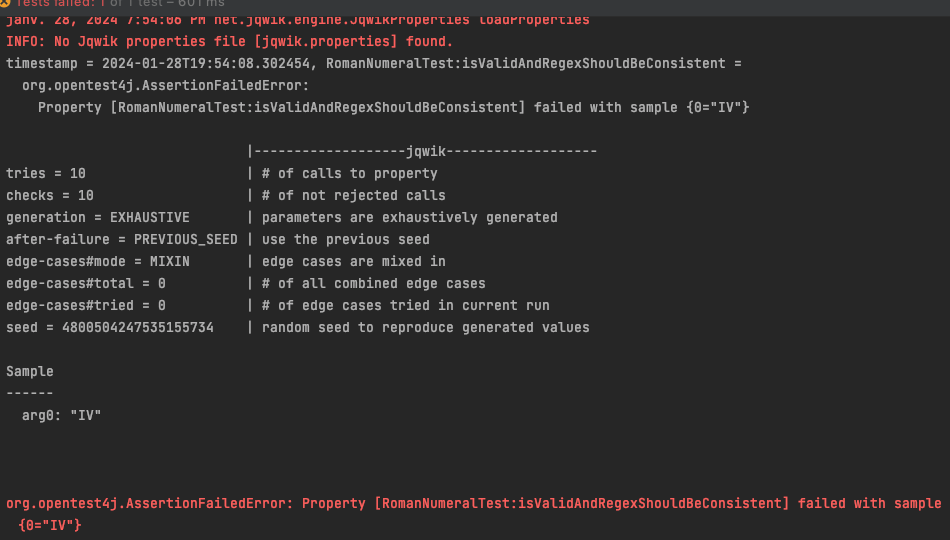
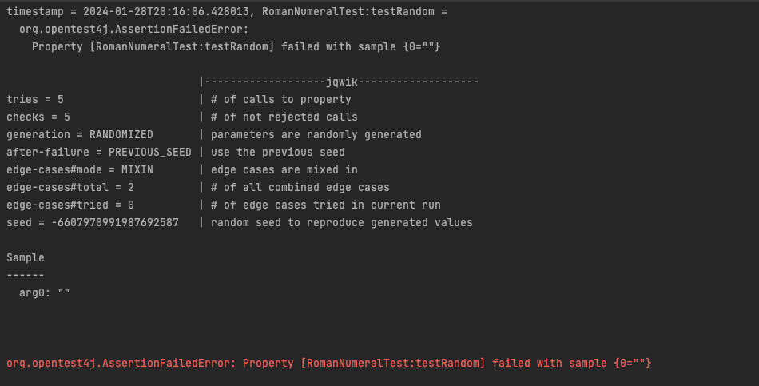
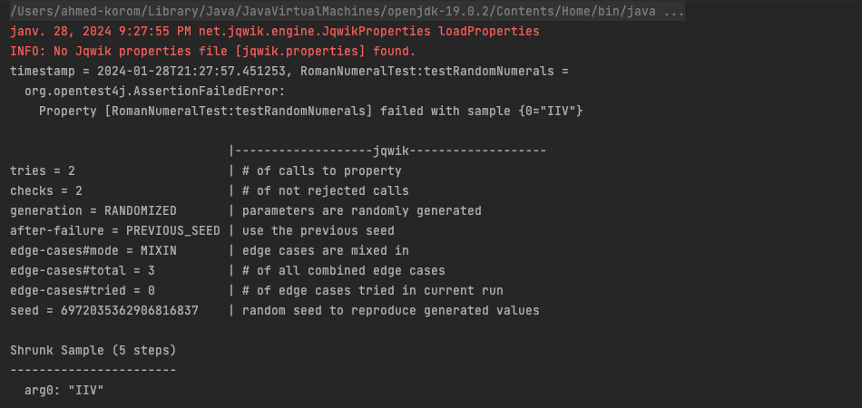
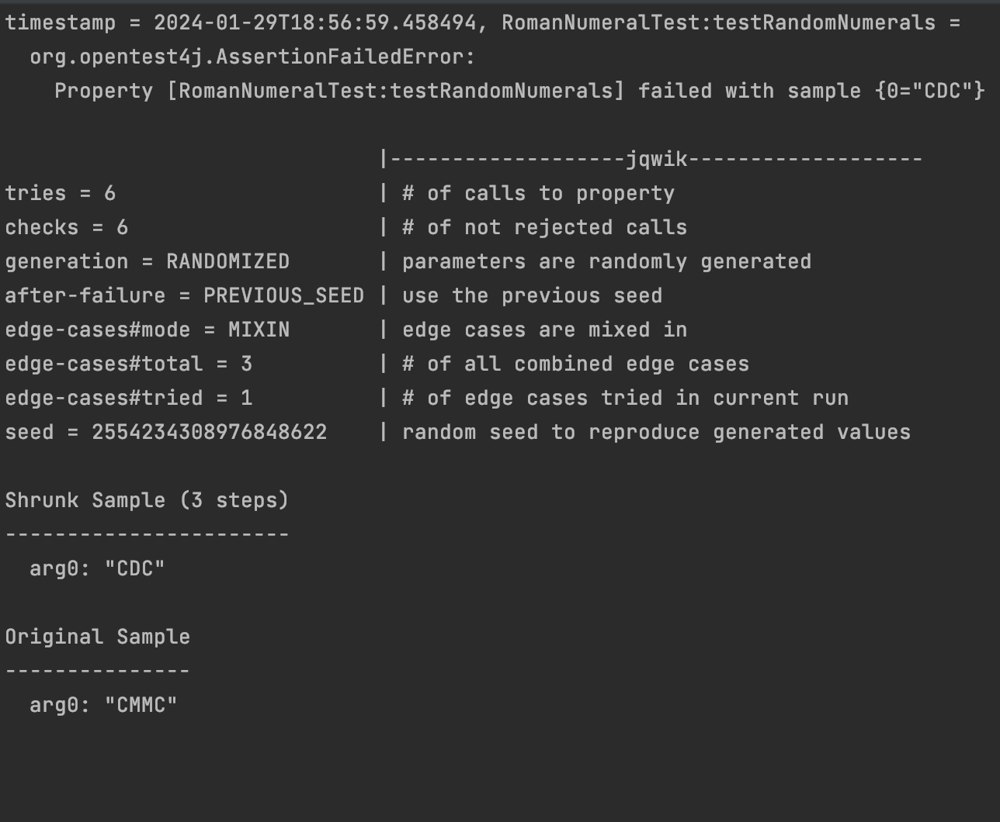

# Roman numerals

Any natural number between 0 and 3999 can be represented in *roman numerals* using the following rules:

1. Only symbols *M*, *D*, *C*, *X*, *V*, *I* can be used. Their values are shown below:

    |   M  |  D  |  C  | L  |  X | V | I |
    |------|-----|-----|----|----|---|---|
    | 1000 | 500 | 100 | 50 | 10 | 5 | 1 |

2. Symbols M, C, X, I can be repeated consecutively up to three times.
3. Symbols D, L and V can not be repeated.
4. When a symbol of lower value of appears to the right of a symbol of equal or higher value, all symbol values are added.
5. When a symbols of lower value appears to the left of a symbols of higher value, the lower value is subtracted from the higher value. Only symbols C, X, I can be subtracted. Each symbol can be subtracted only once. The subtracted symbol must be one fifth or one tenth of the larger.

*Examples:*

-    1 = I
-    4 = IV
-    8 = VIII
-    9 = IX
-   14 = XIV
-   16 = XVI
-   19 = XIX
-   99 = XCIX
-  105 = CV
- 1001 = MI
- 2289 = MMCCLXXXIX

Implement the following methods in the `RomanNumeralUtils` class:

```java
class RomanNumeralUtils {

    public static boolean isValidRomanNumeral(String value) { ... }

    public static int parseRomanNumeral(String numeral) { ... }

    public static String toRomanNumeral(int number) { ... }

}
```

Use [jqwik](https://jqwik.net/) to create property based tests verifying these three methods. Create the tests before implementing the methods. Document any bugs you found with the help of these tests during the process.

**NOTE:** 
- Do not use any existing implementation, write your own code. 
- Use the provided project template as a starting point.
- In the project you can launch the tests with `mvn test`.


# Reponses:


Nous avons utilisé une expression régulière pour comparer le résultat de la fonction isValidNumerals
# Bug 1


- #### Cause : 
    ```java
   for (int i = 0; i < value.length() - 1; i++) {
                        char current = value.charAt(i);
                        char next = value.charAt(i+1);
                        // le plus grand symbol doit etre à droite pour la soustraction
                        if(symbols.indexOf(next) < symbols.indexOf(current) ){
                                /**
                                 * I --> V || X
                                 * X --> L || C
                                 * C --> D || M
                                 * **/
                                return !((current == 'I' && (next == 'V' || next == 'X'))||
                                        (current == 'X' && (next == 'L' || next == 'C'))||
                                        (current == 'C' && (next == 'D' || next == 'M')));
                        }
                }
  ```
Ce bug est causé par l'ajout de la négation à cette condition

# Bug 2



Après l'ajout de la propriété testRandom qui vérifie  la function  isValidRomanNumeral pour toutes
chaine de caratéres on s'est rendu compte que l'expression régulière :
```regexp
^M{0,3}(CM|CD|D?C{0,3})(XC|XL|L?X{0,3})(IX|IV|V?I{0,3})$
```
est vérifiée par la chaine vide.
Nous avons cherché une autre expression qui exclue la chaine vide:
```regexp
^(?=[MDCLXVI])M{0,3}(C[MD]|D?C{0,3})(X[CL]|L?X{0,3})(I[XV]|V?I{0,3})$
```

# Bug 3


Après l'ajout de la propriété testRandom qui vérifie  la function  isValidRomanNumeral pour toutes
chaine de caratéres composée des symboles romains valides  on s'est rendu compte que isValidRomanNumeral ne repsecte
pas la règle : <strong>Each symbol can be subtracted only once</strong>

Nous avons changé cette condition :

```java
if(symbols.indexOf(next) < symbols.indexOf(current) ){
                                /**
                                 * I --> V || X
                                 * X --> L || C
                                 * C --> D || M
                                 * **/
                                return ((current == 'I' && (next == 'V' || next == 'X'))||
                                        (current == 'X' && (next == 'L' || next == 'C'))||
                                        (current == 'C' && (next == 'D' || next == 'M')));
                        }
                }
```
par:
```java
if (symbols.indexOf(next) < symbols.indexOf(current)) {
        /**
         * I --> V || X
         * X --> L || C
         * C --> D || M
         * **/
        boolean validSubtraction = ((current == 'I' && (next == 'V' || next == 'X')) ||
                                     (current == 'X' && (next == 'L' || next == 'C')) ||
                                     (current == 'C' && (next == 'D' || next == 'M')));

        boolean consecutiveSubtraction = (i > 0 && value.charAt(i - 1) == current);

        if (!(validSubtraction && !consecutiveSubtraction)) {
            return false;
        }
    }
```
# Bug 4



On s'est aussi rendu compte grace à la propriété isValidRomanNumeral que notre fonction ne vérifie pas le fait qu'un chiffre
romain utilisé pour une soustraction ne peux plus être utilisé pour une addition avec un chiffre supérieur ou égal.
Pour résoudre ce bug on ajouté la condition suivante : 

```java
  if (symbols.indexOf(next) < symbols.indexOf(current)) {
                                /**
                                 * I --> V || X
                                 * X --> L || C
                                 * C --> D || M
                                 * **/
                                boolean validSubtraction = ((current == 'I' && (next == 'V' || next == 'X')) ||
                                        (current == 'X' && (next == 'L' || next == 'C')) ||
                                        (current == 'C' && (next == 'D' || next == 'M')));

                                boolean consecutiveSubtraction = (i > 0 && value.charAt(i - 1) == current);


                                if(validSubtraction && !consecutiveSubtraction){

                                        usedChar.push(current);

                                }

                                if(!(validSubtraction && !consecutiveSubtraction)){
                                        return  false;
                                }

                        }
                        // condition ajoutée
                        else if(!usedChar.isEmpty()){
                                if(symbols.indexOf(next) <= symbols.indexOf(usedChar.pop())){
                                        return false;
                                }
                        }
                }
```

Pour tester la fonction parseRomanNumeral nous avons utlisé un fichier qui contient tous les nombres romains entre 1 et 3999
et l'avons comparé avec les valeurs produites par parsedValueShouldBeValid et n'avons trouvé aucun bug

Pour tester la fonction toRomanNumeral nous avons procédé de la même manière et avons comparé avec les valeurs du fichier avec
les valeur produites par toRomanNumeral et n'avons trouvé aucun bug
