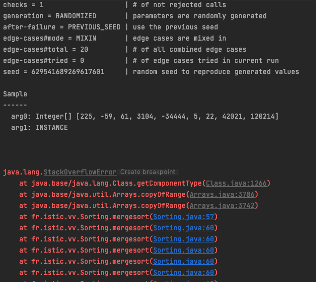
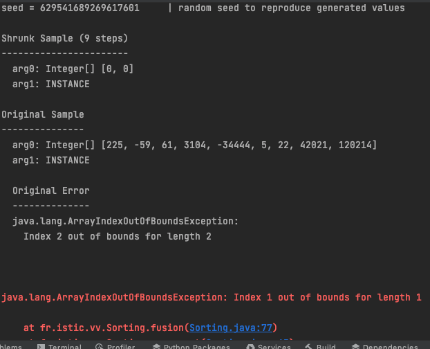

# Sorting algorithms

Implement [Bubble sort](https://en.wikipedia.org/wiki/Bubble_sort), [Quicksort](https://en.wikipedia.org/wiki/Quicksort) and [Merge sort](https://en.wikipedia.org/wiki/Merge_sort) in the `Sorting` class as indicated below. The three methods return a sorted version of the original array. The comparison between the elements of the arrays is specified with an instance of `Comparator`.

```java
class Sorting {

    public static T[] bubblesort(T[] array, Comparator<T> comparator) { ... }

    public static T[] quicksort(T[] array, Comparator<T> comparator)  { ... }

    public static T[] mergesort(T[] array, Comparator<T> comparator) { ... }

}
```

Using [jqwik](https://jqwik.net/) create a differential fuzzing strategy to test the three sorting algorithms at the same time. Create the test before any sorting implementation. Document any bug you find with the help of your tests.


**NOTE:** 
- Do not use any existing implementation, write your own code. 
- Use the provided project template as a starting point.
- In the project you can launch the tests with `mvn test`.

Answers:
## Bug 1 :

#### original :
```java
public static <T> T[] mergesort(T[] array, Comparator<T> comparator) {
        int mid = array.length/2;
        T[] gauche = Arrays.copyOfRange(array,0,mid);
        T[] droite = Arrays.copyOfRange(array,mid,array.length);

        mergesort(gauche,comparator);
        mergesort(droite,comparator);
        
        fusion(array,gauche,droite,comparator);


        return  array;
        }
```


#### Correction :

Oubli de la condition d'arrêt  de la fonction l'erreur à été corrigée après l'ajout de la condition

```java
public static <T> T[] mergesort(T[] array, Comparator<T> comparator) {
        if (array.length > 1) {
            int mid = array.length/2;
            T[] gauche = Arrays.copyOfRange(array,0,mid);
            T[] droite = Arrays.copyOfRange(array,mid,array.length);

            mergesort(gauche,comparator);
            mergesort(droite,comparator);

            fusion(array,gauche,droite,comparator);
        }


        return  array;
        }
        
```

## Bug 2 : 



Oubli de la mise à jour des indices dans la fonction fusion

<pre>
<code>
private static &lt;T&gt; void fusion(T[] array, T[] gauche, T[] droite, Comparator&lt;T&gt; comparator) {
    int indexGauche = 0,
            indexDroite = 0,
            indexFusion = 0;

    while(indexGauche &lt; gauche.length &amp;&amp; indexDroite &lt; droite.length){
        if(comparator.compare(gauche[indexGauche], droite[indexDroite]) &lt;= 0){
            <strong style="color: lightsalmon">array[indexFusion++] = gauche[indexFusion];</strong>
        } else {
             <strong style="color: lightsalmon">array[indexFusion++] = droite[indexDroite];</strong>
        }
    }

    //ajout du reste
    while(indexDroite &lt; droite.length){
         <strong style="color: lightsalmon">array[indexFusion++] = droite[indexDroite];</strong>
    }
    while(indexGauche &lt; gauche.length){
         <strong style="color: lightsalmon">array[indexFusion++] = gauche[indexGauche];</strong>
    }
}
</code>
</pre>


